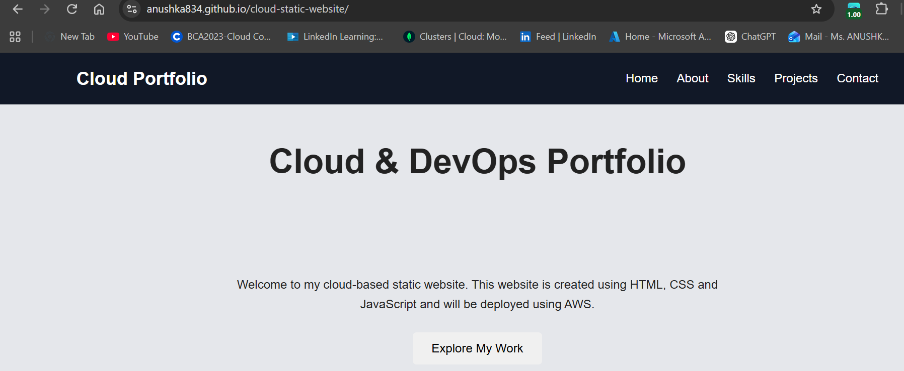

# Cloud Static Website Deployment

## Project Overview

A static website deployed online using **GitHub Pages**.

## Objective

The objective of this project is to create a static website and deploy it using a cloud-based hosting platform so that it can be accessed through a public URL.

## Technologies Used

* HTML
* CSS
* JavaScript
* Git
* GitHub
* GitHub Pages

## Deployment

The website source code is stored in a GitHub repository and deployed using **GitHub Pages**.

### Live Website

https://anushka834.github.io/cloud-static-website/

## Deployment Steps

1. Created the static website.
2. Created a GitHub repository.
3. Uploaded the website files to the repository.
4. Enabled GitHub Pages from repository settings.
5. Selected the `main` branch as the deployment source.
6. GitHub Pages generated a public URL for the website.
7. Verified that the website is accessible online.

## Screenshots

### 1. Website

### 2. Project / Skills

### 3. GitHub Pages Live Website

## Project Outcome

The static website was successfully deployed using GitHub Pages and is accessible through a public URL.

## Repository

The complete project source code and deployment screenshots are available in this GitHub repository.
